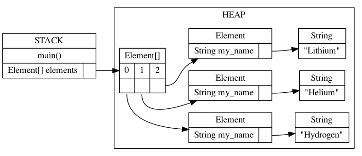

# Worksheet 2: Memory, Classes & Generics


Collaborators:


## Review
1. In your own words, explain what a stack is, and what kind of data goes on the stack.

(1) The stack mainly stores some basic data types of variables (byte, short, int, long, float, double, boolean, char) and object references.
(2) The advantage of stack is that the access speed is faster than the heap, and the stack data can be shared. However, the disadvantage is that the amount of memory occupied by the data stored in the stack needs to be determined at compile time, which is not flexible.

2. In your own words, explain what a heap is, and what kind of data goes on the heap.

(1) The Java heap is a run-time data area from which objects of a class allocate space. These objects are created by directives such as new and destroyed by the garbage collector.
(2) The advantage of heaps is that memory space can be allocated dynamically. The compiler does not have to be told how much memory space is needed because it is allocated dynamically at run time. The downside is that access is slow because memory needs to be dynamically allocated at run time.

3. For each of the following datatypes, say whether a variable of that type would go on the stack or the heap:    
a. `bool`  
b. `int`  
c. `float`  
d. `Car`  
e. `Engine`   
f. `String`

stack:a、b、c、f
heap:d、e

4. In your own words, explain what a data structure is.

A data structure is a way that a computer stores and organizes data. It refers to a collection of data elements that have one or more specific relationships with each other. In general, well-chosen data structures can lead to greater operational or storage efficiency. Data structures are often the same as efficient retrieval algorithms and indexing techniques

5. What must be considered when selecting a data structure for a task?
The first is the amount of storage space required by the algorithm; The second is the time required by the algorithm. The time required for the algorithm involves the following three points:
(1) The total amount of data needed to input when the program is running.
(2) The time required by the computer to execute each instruction.
(3) The number of repeated execution of instructions in the program.


## Exploration
1. Draw the stack and heap at the indicated place in the code. You can use [Java Tutor](http://pythontutor.com/java.html) to check your answer. Upload your drawing to your github repo and put a link in your markdown worksheet file so the drawing displays here.

    ```java
    public class Worksheet {

        public static int twice(int n) {
            int result = 2 * n;
            // DRAW MEMORY HERE
            return result;
        }

        public static int thrice(int n) {
            int result = 3 * n;
            return result;
        }

        public static int sixce(int n) {
            return twice(thrice(n));
        }

        public static void main(String [] args) {
            int n = 7;
            System.out.println(sixce(n));
        }

    }


2. `null` is a special value in Java for reference variables that do not currently refer to anything. In the code below,  which line(s) would a variable be set to `null`?

    ```java
    public class MemoryModel {

        static class Engine {
            String name = "Turbo";
        }

        static class Car {

            int id;
            int hp;
            Engine myEngine;

            public Car(int id) {
                this.id = id;
            }
        }

        public static void doMore() {
            System.out.println("doing more stuff...");
        }

        public static void doWork() {
            double weight = 120.30;
            doMore();
        }

        public static void main(String[] args) {
            int age;
            age = 12;
            age = 15;
            String name = "";

            Car myCar;
            myCar = new Car(1);
            myCar = new Car(2);

            Car my2Car = new Car(3);
            my2Car.hp = 120;

            Car my3Car = new Car(4);
            my3Car.hp = 1000;

            Engine bigEngine = new Engine();
            my3Car.myEngine = bigEngine;
        }

    }

    Line 33

3. Arrays are also reference variables. In the code below, we create an array of three elements, then set the 0th element to 37 and the 1st element to 42. Using [Java Tutor](http://pythontutor.com/java.html) to check your answer, draw out memory at the indicated place in the code. Make sure you select "render all objects on the heap" and "draw pointers as arrows". Do the same for this drawing, upload image and link in your worksheet.

    ```java
    public class Worksheet {
        public static void main(String[] args) {
            int[] array = new int[3];
            array[0] = 37;
            array[1] = 42;
            // DRAW MEMORY HERE
        }
    }


4. Draw out memory at the indicated place in the code. Upload your drawing to your github branch. Explain why that is the result.

    ```java
    public class Worksheet {
        public static void main(String[] args) {
            String[] array = new String[3];
            array[1] = "hello";
            // DRAW MEMORY HERE
        }
    }


5. Consider the following two (equivalent) diagrams of memory below. Change the code marked `FIXME` so that memory will be as depicted at the indicated place in the code.


    

    ```java
    public class Worksheet {

        static class Element {
            private String my_name;

            public Element(String name) {
                this.my_name = name;
            }

        }

        public static void main(String[] args) {
            Element[] elements = new Element[3];
            // FIXME

            // MEMORY DRAW HERE
        }

    }


        elements[0] = new Element("Hydrogen");
        elements[1] = new Element("Helium");
        elements[2] = new Element("Lithium");

6. Suppose you were given the following class definition:

    ```
    public class Bucket<T>{

       private T item;

       public Bucket<T> (T item){
          this.item = item;
          }
    }
    ```

    a. How would you instantiate a `Bucket` object that holds integers?
    b. How would you instantiate a `Bucket` object that holds strings?  
    c. How would you instantiate a `Bucket` object that holds Car objects?  
    d. Write a method `getItem()` that returns the `item` held by a `Bucket`.

a.
        Bucket<Integer> bucket = new Bucket<>(new Integer(0));
b.
        Bucket<String> bucket = new Bucket<>("");
c.
        Bucket<Car> bucket = new Bucket<>(new Car(1));
d.
public T getItem() {
       return this.item;
    }
## Challenge


1.Java has two ways of testing if two objects are the same - `==` and `.equals()`. You might have been told to always use `.equals()`, but there *are* cases where `==` is useful. Read some of the search results from Google on how these are different, then in your own words, explain what `==` does and why you would want to use `.equals()` most of the time.
In JAVA, == and equals both compare objects to determine whether they are equal, but the exact usage is different.
Different attributes:== is the symbol of the operation and equals belongs to the method.
Usage is different:When the objects on either side of == are of basic type, == only compares whether the values of the objects are equal. If they are equal, return true, otherwise return false; When the objects on both sides are reference data types, the function of == is to determine whether the memory addresses of the objects are the same. If both objects point to the same address, it returns true, otherwise it returns false.
Since equals is a method, how it determines whether objects are equal depends on the program. equals belongs to the object class. By default, it determines whether memory addresses are the same, but it is possible to override equals in subclasses of object. If the String class only compares the contents of objects, it returns true if they are consistent, and false if they are not

2.What are the benefits of writing generic classes? When might it be better to _not_ use generics?

Create collection objects, using generics
Benefits: 
1. Avoid the trouble of type conversion, what type is stored, what type is taken out
2. Upgrade runtime exceptions (exceptions thrown after code is run) to compile-time exceptions (errors are reported when code is written).
Cons: What types are generics, and what types of data can only be stored.
So when you need to store multiple types, it's best not to use generics.
